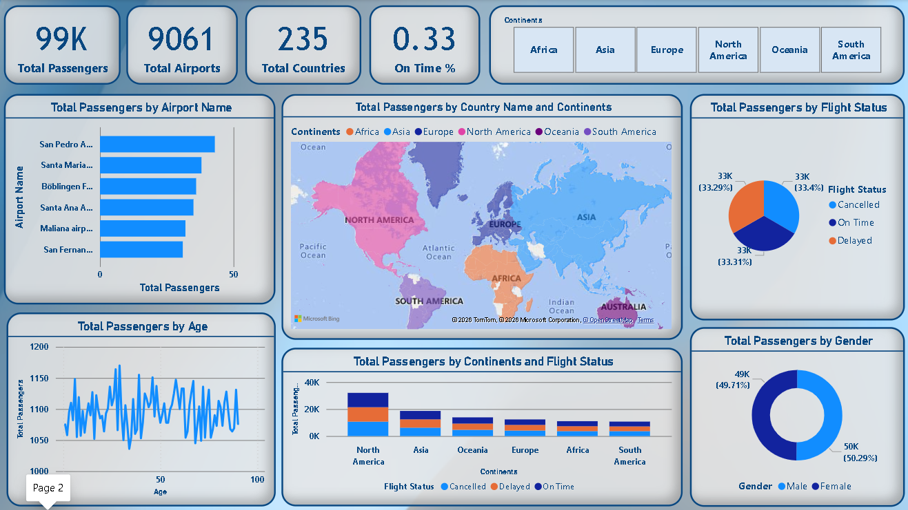

# ✈️ Airline Passenger & Flight Performance Dashboard

<p align="center">
  <b>Interactive Power BI Dashboard for Global Airline Analytics & Operational Insights</b><br><br>


</p>

---

# 📌 Overview

**Airline Passenger & Flight Performance Dashboard** is a comprehensive Power BI analytics solution designed to analyze airline operations, passenger demographics, airport activity, and flight performance across the globe.

The dashboard transforms raw aviation data into meaningful business insights through interactive visualizations, KPI monitoring, and geographical analysis. It enables stakeholders to evaluate operational efficiency, monitor passenger movement, and identify regional performance trends through an intuitive and data-driven interface.

---

# 🎯 Business Objectives

* Monitor global passenger traffic and airport activity
* Analyze flight performance across multiple regions
* Understand passenger demographic patterns
* Compare airline operations by continent and country
* Identify trends in delays, cancellations, and on-time flights
* Support strategic decision-making through interactive analytics

---

# 🖼️ Dashboard Preview

## Overview Page

<p align="center">
  
</p>

## Analytics Dashboard

<p align="center">
  
</p>

---

# 📊 Key Performance Indicators (KPIs)

| KPI                    | Value | Description                   |
| ---------------------- | ----- | ----------------------------- |
| **Total Passengers**   | 99K   | Total passengers analyzed     |
| **Total Airports**     | 9,061 | Airports covered globally     |
| **Countries Covered**  | 235   | Worldwide geographic coverage |
| **On-Time Percentage** | 33%   | Flight punctuality indicator  |

---

# 📈 Dashboard Components & Analytics

## 1. ✈️ Airport Passenger Analysis

**Visualization:** Horizontal Bar Chart

**Data:** Airport Name vs Passenger Count

**Purpose:**

* Identify airports with the highest passenger traffic
* Compare airport performance
* Understand passenger concentration across locations

---

## 2. 🌎 Global Passenger Distribution

**Visualization:** Interactive World Map

**Data:** Country and Continent-wise Passenger Count

**Purpose:**

* Visualize global airline coverage
* Analyze passenger distribution geographically
* Identify major travel regions

---

## 3. 🥧 Flight Status Analysis

**Visualization:** Pie Chart

**Categories:**

* On-Time Flights
* Delayed Flights
* Cancelled Flights

**Purpose:**

* Measure operational efficiency
* Monitor service reliability
* Evaluate flight performance outcomes

---

## 4. 👥 Passenger Demographics Analysis

### Gender Distribution

**Visualization:** Donut Chart

**Categories:**

* Male Passengers
* Female Passengers

**Purpose:**

* Analyze passenger demographic composition
* Understand customer distribution

### Age Analysis

**Visualization:** Line Chart

**Data:** Age vs Passenger Count

**Purpose:**

* Identify age-related travel patterns
* Understand passenger demographics across age groups

---

## 5. 🌍 Continent-wise Flight Performance

**Visualization:** Stacked Column Chart

**Data:** Continents vs Flight Status

**Purpose:**

* Compare operational performance across regions
* Evaluate passenger volume by continent
* Analyze flight status trends geographically

---

# 🔍 Interactivity & User Controls

The dashboard includes interactive continent filters:

* Africa
* Asia
* Europe
* North America
* Oceania
* South America

### Features

* Dynamic filtering
* Cross-visual interaction
* Real-time KPI updates
* Drill-down exploration
* Interactive geographic analysis

All visuals and KPIs update automatically based on user selections, enabling seamless data exploration.

---

# 🧠 Key Insights Derived

* North America contributes the highest passenger volume among all continents.
* Airline operations span across **235 countries**, indicating extensive global coverage.
* Flight statuses are almost evenly distributed between **On-Time**, **Delayed**, and **Cancelled** categories.
* Passenger demographics show a nearly balanced distribution between male and female travelers.
* Several airports account for significantly higher passenger traffic compared to others.
* Passenger activity remains relatively consistent across different age groups.

---

# 🛠️ Tools & Technologies

### Power BI

* Dashboard Development
* Interactive Reporting
* Data Visualization
* Business Intelligence

### Power Query

* Data Cleaning
* Data Transformation
* ETL Processes

### DAX

* KPI Calculations
* Custom Measures
* Business Metrics

### Bing Maps

* Geographic Visualization
* Location-Based Analysis

---

# 🧱 Project Structure

```bash
📦 Airline-Passenger-Flight-Performance-Dashboard
 ┣ 📊 Airline_Passenger_Dashboard.pbix
 ┣ 📁 Dataset
 ┃ ┗ 📄 airline_passenger_data.csv
 ┣ 📁 Screenshots
 ┃ ┣ 📷 Overview_Dashboard.png
 ┃ ┗ 📷 Analytics_Dashboard.png
 ┣ 📄 README.md
 ┗ 📄 LICENSE
```

---

# 🚀 How to Use

### Step 1

Download or clone the repository.

```bash
git clone https://github.com/yourusername/Airline-Passenger-Flight-Performance-Dashboard.git
```

### Step 2

Open the `.pbix` file using **Microsoft Power BI Desktop**.

### Step 3

Refresh the dataset if required.

### Step 4

Use continent filters and interactive visuals to explore insights.

### Step 5

Analyze KPIs, passenger trends, demographic distributions, and flight performance metrics.

---

# 💡 Business Value

This dashboard helps stakeholders:

* Monitor airline operational performance
* Track passenger movement across regions
* Understand customer demographics
* Evaluate airport efficiency
* Identify regional growth opportunities
* Improve strategic planning and decision-making

---

# 🚀 Future Enhancements

* Real-time Flight Data Integration
* Airline-wise Performance Analysis
* Revenue & Profit Analytics
* Predictive Delay Forecasting
* Customer Satisfaction Metrics
* Route Optimization Recommendations
* Advanced Drill-through Reporting

---

# 🎓 Skills Demonstrated

* Power BI Dashboard Development
* Data Visualization
* Data Storytelling
* Business Intelligence
* Data Modeling
* Power Query
* DAX Calculations
* KPI Design
* Geographic Analysis
* Analytical Thinking

---

# 🏁 Conclusion

The **Airline Passenger & Flight Performance Dashboard** provides a comprehensive view of airline operations through interactive analytics and visual storytelling. By integrating passenger demographics, airport activity, geographic distribution, and flight performance metrics into a single platform, the dashboard enables data-driven decision-making and operational performance monitoring at a global scale.

---

# 👩‍💻 Author

### Shehnaz Rangrez

📊 Data Analyst | Power BI Developer | SQL Enthusiast | Data Visualization

**LinkedIn:** [www.linkedin.com/in/shehnaz-rangrez](http://www.linkedin.com/in/shehnaz-rangrez)

**GitHub:** [https://github.com/yourusername](https://github.com/yourusername)

---

# ⭐ Support

If you found this project useful:

⭐ Star the repository

🍴 Fork the project

📢 Share feedback

🤝 Connect for collaboration

---

### Made with ❤️ using Power BI and Data Analytics. ✈️📊
